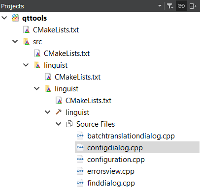
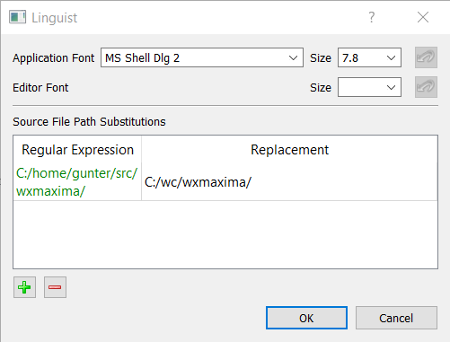

Qt Linguist on a Wee Bit of Steroids
====================================

The purpose of this fork is to make Qt Linguist more usable for editing of .PO files.

Improvements
------------

The changes described below have been made on top of stock Qt Linguist from
Qt 5.15.0.

It builds using cmake. No, it doesn't build using qmake anymore. Who cares.
qmake is dead.

It has a configuration dialog.

The application font is configurable application font - in addition to
configurable editor font size.

There are configurable source path rewrite rules. They are helpful when 
the edited .po files haveabsolute source paths from someone else's machine.

Planned Improvements
--------------------

- Detection of language in the .po file (without user input).
- Spell checking using [QtSpell](https://github.com/manisandro/qtspell).

Other improvements will be planned as soon as the need arises.

Sidebar
-------

*I encourage anyone willing to do so to backport these changes upstream! I have
a signed Qt Contributor agreement, and I hereby authorize anyone willing to
take my changes to commit them to the official Qt Project codebase, with any
requisite modifications as long as they don't remove the attribution of the
git commits themselves. Normalizing the copyright blurbs at the top of source
files is expected and encouraged*

**ALAS**, I don't have the energy to deal with tooling stuck in last century.
I specifically refer to whatever piece of deity-forsaken bovine excrement of
a code review solution the Qt Project chose to use, against all reason (it
seems). Said review system - it-who-shall-not-be-named - is strictly
off-limits to me, because its usability wants me to jump off a bridge,
ideally onto reinforced concrete just to be sure. My will to live has
clearly prevailed, ergo I'm not dealing with that pile of UX excrement.
I leave that to you. Just don't hurt yourself - please and thank you. Be
careful out there!